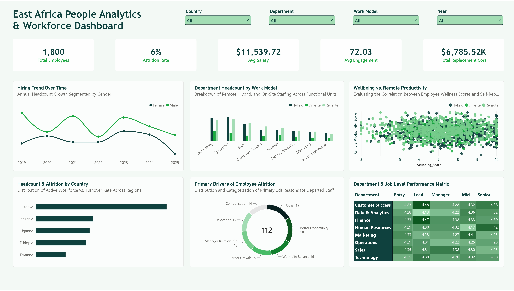

# 🌍 East Africa People Analytics & Workforce Dashboard

An interactive **People Analytics and Workforce Intelligence Dashboard** built with **Microsoft Power BI** to analyse workforce trends, employee engagement, retention, compensation, work models, and departmental performance across selected East African countries.

The project is designed to demonstrate how HR and workforce data can be transformed into clear insights that support **workforce planning, retention strategy, employee experience, and HR decision-making**.

---

## 📊 Dashboard Preview



---

## 🎯 Project Overview

Managing a distributed workforce requires more than tracking headcount.

This dashboard brings together key workforce indicators to provide a consolidated view of:

- Workforce size and growth
- Employee attrition
- Compensation
- Employee engagement
- Replacement costs
- Remote, hybrid, and on-site work models
- Employee wellbeing and productivity
- Attrition drivers
- Departmental performance
- Job-level performance

The dashboard focuses on workforce patterns across **Kenya, Tanzania, Uganda, Ethiopia, and Rwanda**, providing an East African perspective on people analytics.

---

## 📌 Key Workforce Metrics

| Metric | Description |
|---|---|
| **Total Employees** | Total workforce represented in the dataset |
| **Attrition Rate** | Percentage of employees leaving the organisation |
| **Average Salary** | Average employee compensation |
| **Average Engagement** | Average employee engagement score |
| **Total Replacement Cost** | Estimated cost associated with replacing departed employees |

---

## 📈 Dashboard Analysis

### 1. Hiring Trend Over Time

Tracks annual workforce growth from **2019 to 2025**, segmented by gender.

This helps HR teams understand changes in workforce composition and hiring patterns over time.

### 2. Department Headcount by Work Model

Compares **Remote, Hybrid, and On-Site** employees across functional departments.

This provides visibility into how different departments are structured across work arrangements.

### 3. Wellbeing vs. Remote Productivity

Examines the relationship between employee wellbeing scores and self-reported remote productivity.

The analysis helps explore how employee experience relates to productivity within different work models.

### 4. Headcount & Attrition by Country

Compares workforce distribution across:

- Kenya
- Tanzania
- Uganda
- Ethiopia
- Rwanda

The view provides a regional perspective on workforce concentration and turnover.

### 5. Primary Drivers of Employee Attrition

Breaks down the main reasons associated with employee departures, including:

- Better Opportunity
- Work-Life Balance
- Career Growth
- Manager Relationship
- Relocation
- Compensation
- Other

This helps identify areas that HR teams may investigate when developing retention strategies.

### 6. Department & Job Level Performance Matrix

Compares employee performance scores across departments and job levels:

- Entry
- Lead
- Manager
- Mid
- Senior

The matrix makes it easier to identify performance patterns across different workforce segments.

---

## 🔎 Interactive Filters

The dashboard includes interactive filters for:

- **Country**
- **Department**
- **Work Model**
- **Year**

These filters allow users to explore workforce patterns from different organisational and regional perspectives.

---

## 🛠️ Tools & Technologies

- **Microsoft Power BI**
- **Power Query**
- **DAX**
- **Microsoft Excel**
- **Data Modelling**
- **Data Visualization**
- **People Analytics**

---

## 📂 Repository Structure

```text
East-Africa-People-Analytics/
│
├── East_Africa_People_Analytics.pbix
├── East_Africa_People_Analytics.xlsx
├── East_Africa_People_Analytics.jpg
└── README.md
```
